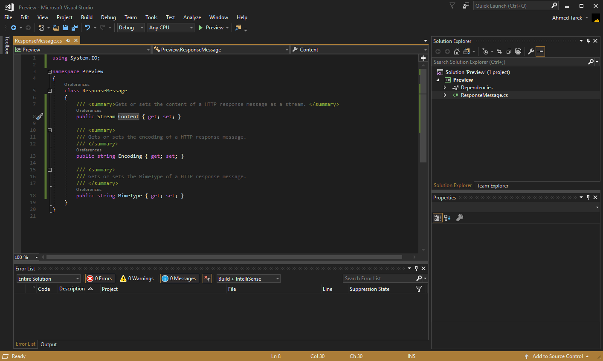
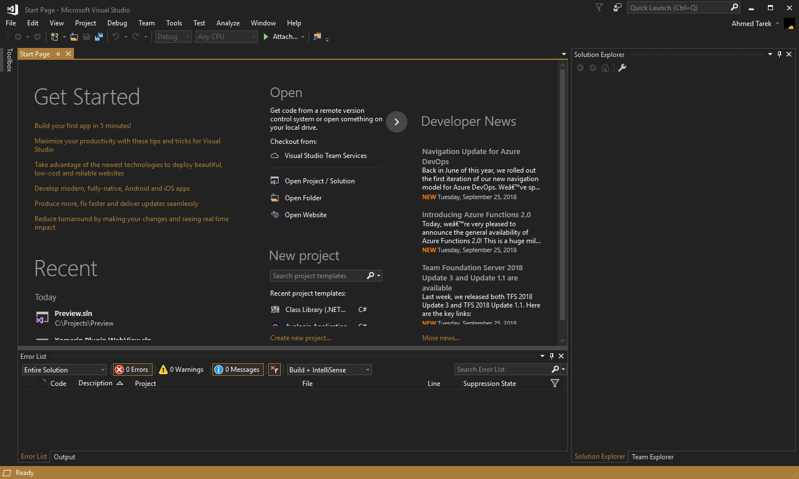
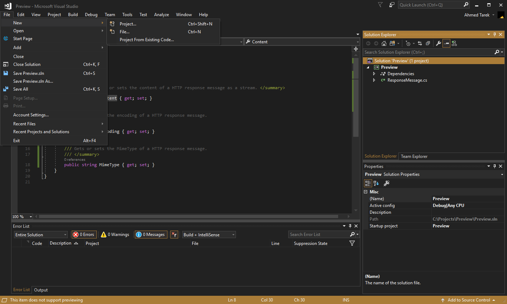
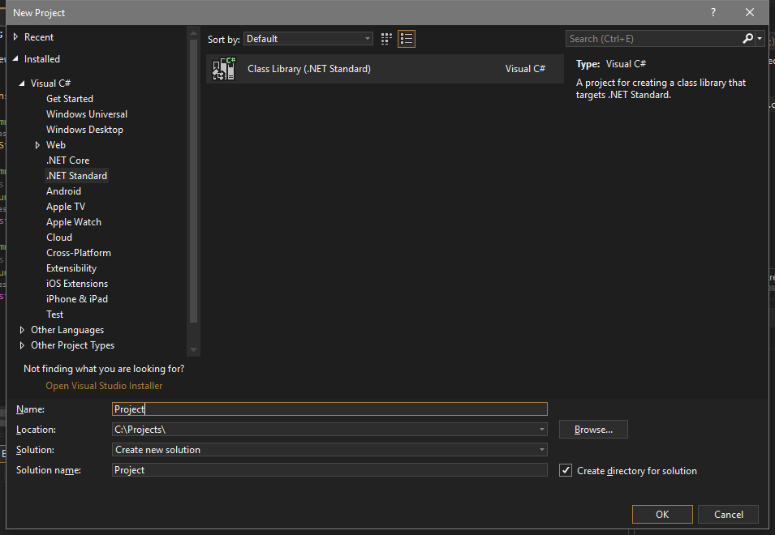

<h2 align="center"></h2>

Beautiful Monokai inspired theme for <a href="https://marketplace.visualstudio.com/items?itemName=pushqrdx.theme-monokai-oblique-vscode">Visual Studio Code</a> and <a href="https://github.com/pushqrdx/monokai">Visual Studio IDE</a>.

## **Installation**

1. Install Color Theme Editor extension for Visual Studio from [the marketplace](https://marketplace.visualstudio.com/items?itemName=VisualStudioPlatformTeam.VisualStudio2017ColorThemeEditor).
2. Go to `Tools > Customize Colors`.
3. In the opened window click **Import**. 
4. Select the `.vstheme` file.
5. Under the Custom Themes select `Monokai Oblique` to apply the theme.

## Tweaking

The Color Theme Editor extension for Visual Studio is a pretty powerful one, yet it's a bit tough to find the elements you want. To solve this issue, I use [Snoop](https://github.com/cplotts/snoopwpf) to spy on  elements and see what color brushes they use. If you're a theme author or just want to refine `Monokai Oblique` check Snoop out. It'll make your life 10x easier 😂. 

For Syntax Highlighting I used [studiostyl.es](http://studiostyl.es/)' scheme creator to make the base syntax colors and through some digging, I refined it furthermore. You can find the original color scheme I created over [here](https://studiostyl.es/schemes/monokai-oblique) yet I encourage you to build upon the version found here at the repo.

## More Screenshots

## Contributing

If you find any inconsistent colors or made any enhancements to the theme, please be generous and contribute them 🙈.
